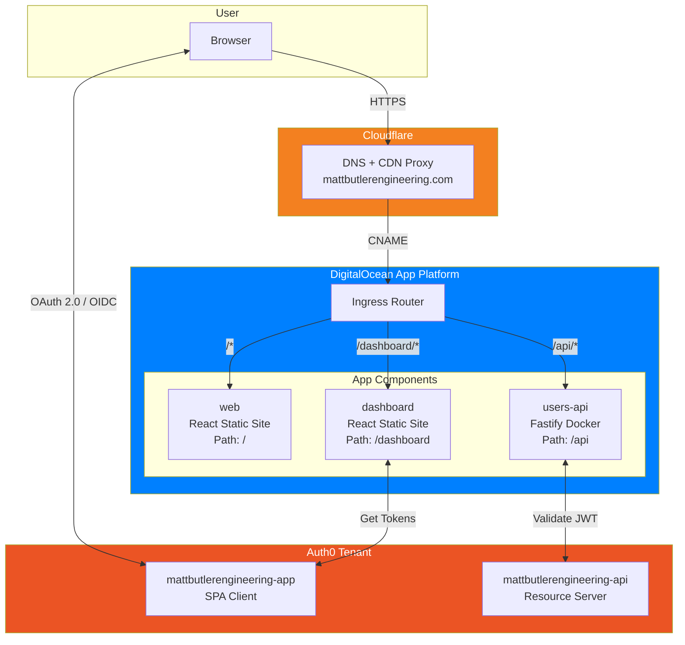
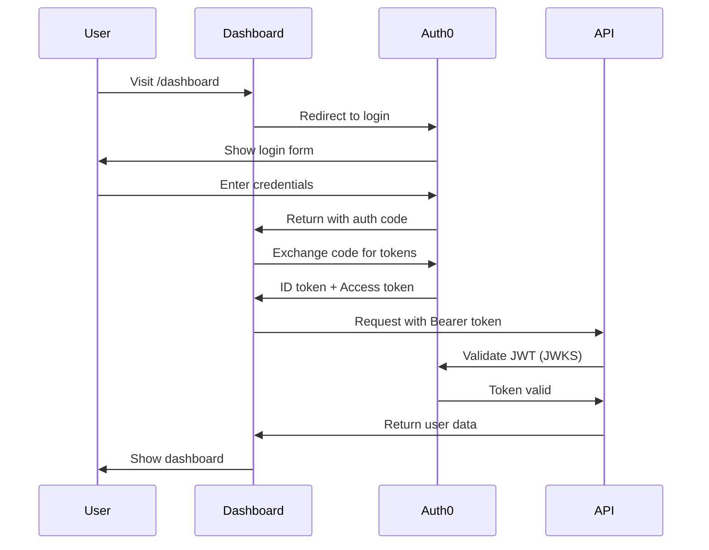

# Architecture

## Overview

Matt Butler Engineering is a monorepo-based web platform with a React frontend, authenticated dashboard, and Fastify API backend, deployed on DigitalOcean App Platform with Cloudflare DNS.

## ASCII Diagram

```
                                    ┌─────────────────────────────────────────────────────────────┐
                                    │                        Auth0                                │
                                    │                                                             │
                                    │  ┌─────────────────┐    ┌─────────────────────────────┐   │
                                    │  │ mattbutlereng-  │    │ mattbutlerengineering-api   │   │
                                    │  │ ineering-app    │    │ (Resource Server)           │   │
                                    │  │ (SPA Client)    │    │                             │   │
                                    │  └────────┬────────┘    └──────────────┬──────────────┘   │
                                    │           │                            │                   │
                                    └───────────┼────────────────────────────┼───────────────────┘
                                                │                            │
                                                │ OAuth 2.0 / OIDC           │ JWT Validation
                                                │                            │
┌──────────┐                        ┌───────────▼────────────────────────────▼───────────────────┐
│          │                        │                                                            │
│  User    │    HTTPS Request       │                      Cloudflare                            │
│ Browser  │ ─────────────────────► │                   (DNS + Proxy)                            │
│          │                        │                                                            │
└──────────┘                        │                 mattbutlerengineering.com                  │
                                    │                                                            │
                                    └───────────────────────────┬────────────────────────────────┘
                                                                │
                                                                │ CNAME
                                                                ▼
                                    ┌────────────────────────────────────────────────────────────┐
                                    │              DigitalOcean App Platform                     │
                                    │          mattbutlerengineering-8ryim.ondigitalocean.app   │
                                    │                                                            │
                                    │  ┌─────────────────────────────────────────────────────┐  │
                                    │  │                    Ingress Router                    │  │
                                    │  │                                                      │  │
                                    │  │   /api/*  ──────►  users-api                        │  │
                                    │  │   /dashboard/* ──► dashboard                        │  │
                                    │  │   /* ──────────►   web                              │  │
                                    │  │                                                      │  │
                                    │  └──────────┬─────────────────┬─────────────────┬──────┘  │
                                    │             │                 │                 │         │
                                    │             ▼                 ▼                 ▼         │
                                    │  ┌──────────────┐  ┌──────────────┐  ┌──────────────┐    │
                                    │  │   users-api  │  │  dashboard   │  │     web      │    │
                                    │  │              │  │              │  │              │    │
                                    │  │   Fastify    │  │    React     │  │    React     │    │
                                    │  │   Docker     │  │  Static Site │  │ Static Site  │    │
                                    │  │   Port 3001  │  │              │  │              │    │
                                    │  │              │  │  /dashboard  │  │      /       │    │
                                    │  └──────────────┘  └──────────────┘  └──────────────┘    │
                                    │                                                            │
                                    └────────────────────────────────────────────────────────────┘
```

## Mermaid Diagram



## Component Details

### Frontend Apps

| App | Technology | Path | Description |
|-----|------------|------|-------------|
| `web` | React + Vite | `/` | Public marketing site |
| `dashboard` | React + Vite | `/dashboard` | Authenticated user dashboard |

### Backend Services

| Service | Technology | Path | Description |
|---------|------------|------|-------------|
| `users-api` | Fastify + Prisma | `/api` | User management API |

### Infrastructure

| Component | Provider | Purpose |
|-----------|----------|---------|
| App Platform | DigitalOcean | Hosting (static sites + Docker services) |
| DNS + CDN | Cloudflare | Domain routing, SSL, caching |
| Authentication | Auth0 | OAuth 2.0 / OIDC identity provider |
| IaC | Pulumi (TypeScript) | Infrastructure as Code |

### Monorepo Structure

```
mattbutlerengineering/
├── apps/
│   ├── web/              # Public website
│   └── dashboard/        # Authenticated dashboard
├── services/
│   └── users/            # Users API (Fastify)
├── packages/
│   ├── types/            # Shared TypeScript types
│   ├── auth/             # Auth utilities (React + Fastify)
│   └── config/           # Shared ESLint/TypeScript config
└── infrastructure/
    └── pulumi/           # IaC definitions
```

## Data Flow

### Authentication Flow



## URLs

| Environment | URL |
|-------------|-----|
| Production | https://mattbutlerengineering.com |
| Dashboard | https://mattbutlerengineering.com/dashboard |
| API | https://mattbutlerengineering.com/api |
| DO Direct | https://mattbutlerengineering-8ryim.ondigitalocean.app |
| Auth0 | https://dev-ytbgmz5ls3wh4xdx.us.auth0.com |
