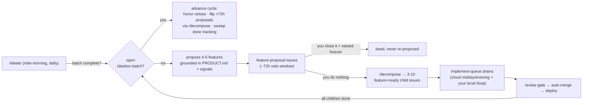

# The Self-Improving Loop — Operator Guide

> **Audience:** Matt (the operator). What the autonomous ideation loop does,
> what it will never do without you, and the handful of verbs you actually have.
>
> Mechanics live in [`.claude/skills/ideate/SKILL.md`](../.claude/skills/ideate/SKILL.md).
> Routine prompts live in [`scheduled-tasks.md`](./scheduled-tasks.md).
> Product direction lives in [`PRODUCT.md`](../PRODUCT.md).

## TL;DR

The repo proposes its own features, waits ~3 days for you to object, builds
whatever you didn't object to, merges green PRs, and proposes the next batch
when it finishes. **Your only recurring job is optional: close proposal issues
you don't like.** Silence is consent.

## The loop in one picture

Grounding: `PRODUCT.md` themes + live signals (`metrics/*.jsonl`, ACMM state,
open `audit`/`sentry`/`ci-fix` issues, TODO clusters, recent git history).
Cloud sessions never touch the live site (no egress) — signals are always
repo-committed artifacts.

## Your four verbs

| Verb | How | When |
| --- | --- | --- |
| **Veto** | Close the `[Proposal]` issue (or add the `vetoed` label) | Any time before it decomposes (~72h). Permanent — the idea is never re-proposed. |
| **Steer** | Edit `PRODUCT.md` — themes, non-goals, guardrails | Whenever direction feels off. Next batch grounds on the new text. Quarterly skim is plenty. |
| **Pause** | Disable the `/ideate` step (or whole `mbe-morning` routine) at <https://claude.ai/code/routines> | Vacation, quota pinch, or you want the queue to itself. In-flight batch keeps draining harmlessly. |
| **Rescue** | Remove `ready` from a decomposed child (or close it); label stuck things `deferred` | A feature turned out wrong mid-build, or something is blocking batch completion. |

Everything else — proposing, decomposing, building, testing, reviewing,
merging, telemetry, re-ideating — is automatic.

## Life of a batch

| Day | What happens | Your involvement |
| --- | --- | --- |
| 0 | `/ideate` files `[Ideation] Batch <date>` + 4-5 `[Proposal]` issues | Skim titles on your phone; close any you dislike |
| 0-3 | Veto window | Optional vetoes |
| ~3 | Un-vetoed proposals decompose (max 2/day) into `feature`+`ready` children | None |
| 3-8 | Queue drains: cloud `mbe-midday`/`mbe-evening` (≤3 issues each) + your local `/loop 30m /implement-queue` sprints when you feel like it | None (local sprints optional, just faster) |
| ~8 | All children closed → tracking issues close → batch closes with a scorecard comment | None |
| next morning | New batch proposed automatically | Back to day 0 |

Safety valves: children stuck in `agent-failed`/`stealable`/`needs-review` for
7 days get `deferred` (stop blocking, stay open); a batch force-completes 28
days after decomposition. A wedged batch cannot stall the loop forever.

## What you'll see on GitHub (and what it means)

| You see | It means | Act? |
| --- | --- | --- |
| 4-5 new `[Proposal]` issues + one `[Ideation] Batch` issue | New batch, veto window open | Only if you object |
| `[Feature] … [i/M]` issues labeled `ready` | A proposal survived and decomposed | No |
| PRs merging on their own | Review gate passed + CI green (existing policy) | No |
| Small `chore(metrics): …` PRs, auto-merged | Sensors persisting telemetry from ephemeral cloud checkouts | No — this is the loop's heartbeat; its *absence* for days is the anomaly |
| `chore(acmm): daily audit` PRs | ACMM re-scoring | No |
| An issue labeled `needs-review` or `stealable` | Automation hit its limit on one item | When convenient — it no longer blocks the batch after 7 days |

## One-time setup (do once, then never again)

Tracked as the HITL checklist in [`scheduled-tasks.md`](./scheduled-tasks.md);
summary:

1. At <https://claude.ai/code/routines>, paste the three prompt blocks from
   `scheduled-tasks.md`: the `/ideate` block into **mbe-morning**, the
   `/implement-queue` block into **mbe-midday** *and* **mbe-evening**, and the
   updated optimize block (Step 0 reconcile + Step 6 persist) into
   **mbe-evening**.
2. Click **Run** on `mbe-morning` — validates `/ideate` end-to-end and files
   batch 1.
3. Click **Run** on `mbe-midday` — validates cloud `/implement-queue`
   (worktrees + `pnpm install` are unproven in the cloud env; the documented
   fallback is a single no-worktree worker with your local loop as the heavy
   drain). Its log also shows why daily acmm PRs stopped on 2026-07-10.
4. Skim `PRODUCT.md` when you get 15 minutes — it shipped as Claude's draft.

## Health checks (only if something smells off)

- **No proposals for >1 day with no open batch** → `mbe-morning` isn't running
  `/ideate`; check the routine's last run log.
- **Proposals older than ~4 days, still open, not vetoed** → cycle-check isn't
  flipping; same place to look.
- **No `chore(metrics)` PRs for several days** → telemetry persistence broke;
  run `node scripts/reconcile-queue-telemetry.mjs` and
  `node scripts/sensor-report.mjs --json | jq '.sensors.queueEfficiency'`
  locally to see current state.
- **Quota pinch** (interactive sessions throttled) → `/token-report blocks`,
  then dial the cloud batch size from 3 to 1-2 in the midday/evening prompts.
- **Runaway wrong feature being built** → Rescue verb: strip `ready` from its
  remaining children, close what's wrong. Reverts get caught by the existing
  revert-RCA loop.

## Design guarantees (why this is safe to ignore)

- Proposals are **never** labeled `ready` — nothing builds during the veto
  window.
- Batches are strictly sequential — the system cannot flood the backlog.
- Vetoes are permanent dedup memory.
- Merge safety is unchanged: the same review gate + CI Gate + auto-merge
  policy that has run the queue since July (91.7% acceptance, 0 reverts)
  gates every generated PR.
- All loop state is in GitHub issues/labels — nothing hides in a session or a
  local file; any session (yours or cloud) sees the same world.
