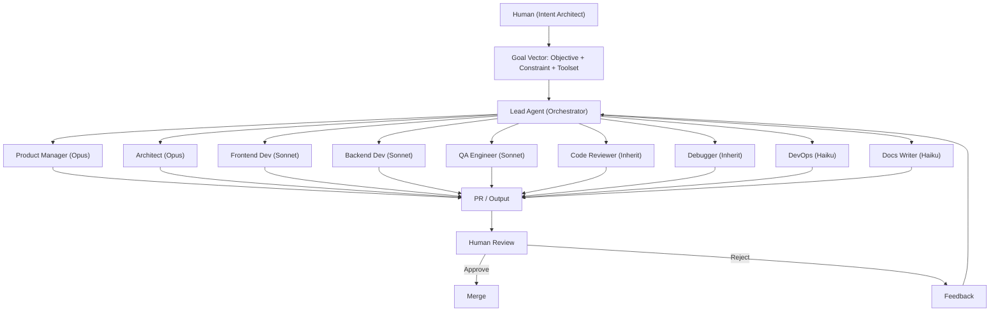
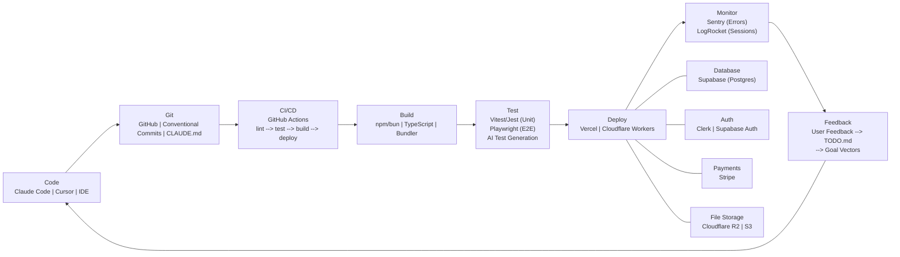

# Architecture Design Document: One-Man Dev Team

This document defines the AI agent orchestration architecture and full infrastructure stack for a solo developer operating as a synthetic team. It covers the agent coordination layer, the end-to-end development pipeline, and component evaluations with risk assessments for each layer of the stack.

---

## AI Agent Orchestration Layer

### Communication Protocols

- **Human --> Lead Agent**: Goal Vectors (Objective, Constraint, Toolset)
- **Lead Agent --> Subagents**: Task assignments with scoped context
- **Subagents --> Lead Agent**: Results, PRs, status updates
- **Lead Agent --> Human**: Synthesized summary, PRs ready for review

### Data Flow

1. Human defines Goal Vector (what, constraints, available tools)
2. Lead Agent decomposes into subtasks
3. Subagents execute in parallel (each in own context window + git worktree)
4. Results flow back to Lead Agent for synthesis
5. Human reviews, approves/rejects, provides feedback
6. Feedback loops back into CLAUDE.md and agent memory

### Context Isolation Boundaries

- Each subagent runs in its own context window
- Each subagent operates in its own git worktree (avoids conflicts)
- Subagents cannot see each other's work until synthesis
- Lead Agent holds the coordination context
- Human holds the strategic context (product vision, user needs)

---

## Full Infrastructure Stack

### Pipeline Data Flow

Code is written with AI-augmented editors (Claude Code, Cursor) and committed to GitHub using conventional commits. CLAUDE.md files travel with the repository to preserve agent context. GitHub Actions orchestrate the CI/CD pipeline: linting, running unit tests (Vitest/Jest) and E2E tests (Playwright), building the TypeScript bundle, and deploying to Vercel or Cloudflare Workers. In production, Sentry captures errors and LogRocket records user sessions. Feedback from monitoring and user reports flows back into TODO.md, which feeds new Goal Vectors into the agent orchestration layer, closing the loop.

Data stores (Supabase for Postgres, Clerk or Supabase Auth for authentication, Stripe for payments, Cloudflare R2 or S3 for file storage) connect at the deployment layer and are accessed by the running application.

---

## Component Evaluations

---

### Component 1: AI Coding Tool

#### Comparison Matrix

| Tool           | Strengths                                                                               | Weaknesses                                      | Pricing               | Best For                                 |
| -------------- | --------------------------------------------------------------------------------------- | ----------------------------------------------- | --------------------- | ---------------------------------------- |
| Claude Code    | Terminal-native, best multi-agent orchestration, 1M context (beta), Opus 4.6 quality    | No GUI IDE, token-heavy with chained agents     | $100-200/mo (Pro/Max) | Complex multi-file changes, architecture |
| Cursor         | IDE-integrated, fast Composer model (4x faster), up to 8 parallel agents, visual editor | Less capable for complex architecture decisions | $20/mo (Pro)          | Rapid iteration, refactoring             |
| Windsurf       | Arena Mode (side-by-side model comparison), Plan Mode, parallel multi-agent             | Newer, smaller ecosystem                        | $15-40/mo             | Model comparison, exploratory work       |
| GitHub Copilot | Ubiquitous, good autocomplete, free tier available                                      | Weakest for autonomous multi-file work          | $10-39/mo             | Line-by-line coding, boilerplate         |

#### Risk Assessment

| Factor           | Claude Code | Cursor | Windsurf | GitHub Copilot |
| ---------------- | ----------- | ------ | -------- | -------------- |
| Reliability      | Medium      | High   | Medium   | High           |
| Vendor Lock-in   | Low         | Medium | Low      | Low            |
| Cost Trajectory  | High        | Low    | Medium   | Low            |
| Community Health | High        | High   | Medium   | High           |
| Deprecation Risk | Low         | Medium | High     | Low            |

#### Recommendation

Claude Code is the primary choice for development work. Its multi-agent orchestration, massive context window, and Opus 4.6 model quality make it unmatched for complex architectural work, multi-file refactors, and autonomous task execution. Cursor serves as a strong secondary tool for rapid UI iteration and visual editing where an IDE experience is preferred. The combination covers both deep autonomous work and fast interactive coding.

---

### Component 2: Hosting

#### Comparison Matrix

| Tool                     | Strengths                                                                                | Weaknesses                                                | Pricing                                | Best For                         |
| ------------------------ | ---------------------------------------------------------------------------------------- | --------------------------------------------------------- | -------------------------------------- | -------------------------------- |
| Vercel                   | Zero-config Next.js, preview deployments, edge functions                                 | Vendor lock-in to Next.js, costs scale with traffic       | Free tier generous, Pro $20/mo         | Next.js / React applications     |
| Cloudflare Workers/Pages | Workers (serverless), Pages (static), R2 (storage), D1 (SQLite), very generous free tier | Non-standard runtime (no Node.js APIs), smaller ecosystem | Generous free tier, Workers Paid $5/mo | Global edge compute              |
| AWS (Amplify/Lambda)     | Full service catalog, Amplify (frontend), Lambda (serverless)                            | Complexity, billing surprises, steep learning curve       | Pay-as-you-go                          | Complex infrastructure needs     |
| VPS (Hetzner/Linode)     | Full control, fixed cost, any stack                                                      | You manage everything (security, updates, scaling)        | $5-40/mo                               | Simple deployments, full control |

#### Risk Assessment

| Factor           | Vercel | Cloudflare | AWS  | VPS    |
| ---------------- | ------ | ---------- | ---- | ------ |
| Reliability      | High   | High       | High | Medium |
| Vendor Lock-in   | High   | Medium     | High | Low    |
| Cost Trajectory  | High   | Low        | High | Low    |
| Community Health | High   | High       | High | High   |
| Deprecation Risk | Low    | Low        | Low  | Low    |

#### Recommendation

Vercel is the default for Next.js projects due to its zero-config deployment, preview URLs per PR, and best-in-class developer experience. For edge-first or cost-sensitive projects, Cloudflare Workers/Pages offers superior global distribution and an extremely generous free tier. The two complement each other well: Vercel for full-stack React apps, Cloudflare for APIs, static sites, and edge workloads.

---

### Component 3: Database

#### Comparison Matrix

| Tool              | Strengths                                                | Weaknesses                                        | Pricing                              | Best For                                     |
| ----------------- | -------------------------------------------------------- | ------------------------------------------------- | ------------------------------------ | -------------------------------------------- |
| Supabase          | Postgres + Auth + Realtime + Storage, Row Level Security | Postgres complexity for simple apps               | Free: 500MB / 2 projects, Pro $25/mo | Full-stack apps needing auth + database      |
| PlanetScale       | MySQL-compatible, branching, serverless                  | No free tier (removed 2024), MySQL only           | Hobby $39/mo                         | Schema-heavy apps needing branching          |
| Neon              | Serverless Postgres, branching, autoscale to zero        | Newer, smaller community                          | Free: 512MB, Pro $19/mo              | Serverless Postgres with cold starts         |
| SQLite (Turso/D1) | Embedded, zero latency, edge-native                      | Limited concurrent writes, less ecosystem tooling | Turso free: 9GB                      | Read-heavy, single-region, simplest possible |

#### Risk Assessment

| Factor           | Supabase | PlanetScale | Neon   | SQLite (Turso/D1) |
| ---------------- | -------- | ----------- | ------ | ----------------- |
| Reliability      | High     | High        | Medium | High              |
| Vendor Lock-in   | Medium   | High        | Medium | Low               |
| Cost Trajectory  | Medium   | High        | Medium | Low               |
| Community Health | High     | Medium      | Medium | High              |
| Deprecation Risk | Low      | Medium      | Medium | Low               |

#### Recommendation

Supabase is the default for most projects because it bundles Postgres, authentication, realtime subscriptions, and file storage into a single platform with excellent developer experience. The unified auth + database layer eliminates an entire integration surface. For ultra-simple applications or edge-first architectures where latency is critical, SQLite via Turso or Cloudflare D1 offers zero-overhead reads and the simplest possible operational model.

---

### Component 4: CI/CD

#### Comparison Matrix

| Tool           | Strengths                                             | Weaknesses                                     | Pricing            | Best For                                |
| -------------- | ----------------------------------------------------- | ---------------------------------------------- | ------------------ | --------------------------------------- |
| GitHub Actions | Native to GitHub, massive marketplace, YAML workflows | YAML complexity, debugging is painful          | Free: 2,000 min/mo | GitHub-based projects (most solo devs)  |
| GitLab CI      | Built-in to GitLab, Auto DevOps, container registry   | Smaller marketplace, GitLab ecosystem required | Free: 400 min/mo   | GitLab users, container-heavy workflows |
| CircleCI       | Fast builds, good caching, orbs (reusable configs)    | Another service to manage, costs scale faster  | Free: 6,000 min/mo | Complex build pipelines, monorepos      |

#### Risk Assessment

| Factor           | GitHub Actions | GitLab CI | CircleCI |
| ---------------- | -------------- | --------- | -------- |
| Reliability      | High           | High      | High     |
| Vendor Lock-in   | Medium         | High      | Low      |
| Cost Trajectory  | Low            | Low       | Medium   |
| Community Health | High           | High      | Medium   |
| Deprecation Risk | Low            | Low       | Medium   |

#### Recommendation

GitHub Actions is the clear choice for solo developers already on GitHub. The native integration means no additional service to configure, the marketplace provides thousands of pre-built actions, and the free tier of 2,000 minutes per month is more than sufficient for individual projects. YAML debugging remains painful, but AI coding tools mitigate this significantly by generating and troubleshooting workflow files.

---

### Component 5: Monitoring

#### Comparison Matrix

| Tool      | Strengths                                                   | Weaknesses                                   | Pricing                          | Best For                                |
| --------- | ----------------------------------------------------------- | -------------------------------------------- | -------------------------------- | --------------------------------------- |
| Sentry    | Error tracking + performance + session replay, excellent DX | Session replay is newer/limited vs LogRocket | Free: 5K errors/mo, Team $26/mo  | Error tracking with good DX             |
| LogRocket | Session replay + error tracking + product analytics         | Expensive, heavy script weight               | Free: 1K sessions/mo, Pro $99/mo | Understanding user behavior + debugging |
| Datadog   | Full observability (APM, logs, metrics, traces)             | Overkill for solo dev, expensive at scale    | Free: 5 hosts, Pro $15/host/mo   | Complex infrastructure monitoring       |

#### Risk Assessment

| Factor           | Sentry | LogRocket | Datadog |
| ---------------- | ------ | --------- | ------- |
| Reliability      | High   | High      | High    |
| Vendor Lock-in   | Low    | Medium    | High    |
| Cost Trajectory  | Low    | High      | High    |
| Community Health | High   | Medium    | High    |
| Deprecation Risk | Low    | Medium    | Low     |

#### Recommendation

Sentry is the primary monitoring tool. It provides the best error tracking developer experience, a generous free tier, and a lightweight client SDK. For a solo developer, comprehensive error tracking with stack traces, breadcrumbs, and performance monitoring covers 90% of observability needs. Add LogRocket only when you need session replay to debug specific UX issues that error tracking alone cannot explain.

---

### Component 6: Project Management

#### Comparison Matrix

| Tool    | Strengths                                               | Weaknesses                                        | Pricing              | Best For                                       |
| ------- | ------------------------------------------------------- | ------------------------------------------------- | -------------------- | ---------------------------------------------- |
| TODO.md | Plain markdown in repo, version-controlled, AI-readable | No filtering, search, or history beyond git log   | Free                 | Solo devs starting out (fewer than 50 items)   |
| Linear  | Fast, keyboard-driven, MCP server available             | Another tool to maintain, potential over-process  | Free for individuals | Structured workflows, backlog exceeds 50 items |
| Trello  | Visual kanban, simple drag-and-drop                     | Slower, less developer-native, no MCP integration | Free tier generous   | Visual thinkers, simple task boards            |

#### Risk Assessment

| Factor           | TODO.md | Linear | Trello |
| ---------------- | ------- | ------ | ------ |
| Reliability      | High    | High   | High   |
| Vendor Lock-in   | Low     | Medium | Medium |
| Cost Trajectory  | Low     | Low    | Low    |
| Community Health | High    | High   | High   |
| Deprecation Risk | Low     | Low    | Low    |

#### Recommendation

Start with TODO.md for zero-overhead task tracking that lives in the repository and is natively readable by AI agents. This keeps the feedback loop tight: tasks are defined where the code lives, and agents can read and update them directly. Graduate to Linear when the backlog exceeds approximately 50 items and you need filtering, search, cycle tracking, or the MCP server integration for AI-driven project management.

---

### Component 7: Authentication

#### Comparison Matrix

| Tool               | Strengths                                                   | Weaknesses                                                    | Pricing                   | Best For                                 |
| ------------------ | ----------------------------------------------------------- | ------------------------------------------------------------- | ------------------------- | ---------------------------------------- |
| Clerk              | Hosted UI, social login, MFA, user management dashboard     | Vendor lock-in, costs scale with users                        | Free: 10K MAU, Pro $25/mo | Fastest implementation, best DX          |
| Auth.js (NextAuth) | Open-source, self-hosted, flexible providers                | More setup work, you manage sessions/tokens, less polished UI | Free                      | Full control, no vendor lock-in          |
| Supabase Auth      | Part of Supabase platform, Row Level Security, social login | Tied to Supabase ecosystem                                    | Free with Supabase        | Supabase users (auth + database unified) |

#### Risk Assessment

| Factor           | Clerk | Auth.js | Supabase Auth |
| ---------------- | ----- | ------- | ------------- |
| Reliability      | High  | High    | High          |
| Vendor Lock-in   | High  | Low     | Medium        |
| Cost Trajectory  | High  | Low     | Low           |
| Community Health | High  | High    | High          |
| Deprecation Risk | Low   | Low     | Low           |

#### Recommendation

Clerk is the default for the fastest launch. Its pre-built UI components, social login, MFA, and user management dashboard eliminate days of authentication implementation. The free tier of 10K monthly active users is generous enough for most early-stage projects. If you are already using Supabase for your database, Supabase Auth is the natural choice because it unifies auth and data under one platform with Row Level Security. Choose Auth.js only when maximum control and zero vendor lock-in are hard requirements.

---

### Component 8: Payments

#### Comparison Matrix

| Tool          | Strengths                                                 | Weaknesses                                                          | Pricing                    | Best For                                                |
| ------------- | --------------------------------------------------------- | ------------------------------------------------------------------- | -------------------------- | ------------------------------------------------------- |
| Stripe        | Industry standard, best docs, global reach, full API      | Complex for simple use cases, you handle tax compliance             | 2.9% + 30c per transaction | Any payment type (subscriptions, one-time, marketplace) |
| Polar.sh      | Built for open-source / digital products, handles VAT/tax | Newer, smaller ecosystem, limited payment types                     | 5% fee                     | Digital products, open-source monetization              |
| Lemon Squeezy | Merchant of record (handles tax/VAT), simple API          | Higher fee, less flexibility than Stripe, acquired by Stripe (2024) | 5% + 50c per transaction   | Global sales without tax headaches                      |

#### Risk Assessment

| Factor           | Stripe | Polar.sh | Lemon Squeezy |
| ---------------- | ------ | -------- | ------------- |
| Reliability      | High   | Medium   | High          |
| Vendor Lock-in   | Medium | Low      | Medium        |
| Cost Trajectory  | Low    | Medium   | Medium        |
| Community Health | High   | Medium   | Medium        |
| Deprecation Risk | Low    | Medium   | Medium        |

#### Recommendation

Stripe is the default for payments. It is the industry standard with the best documentation, widest payment method support, and most flexible API. Every edge case you will encounter has been solved by someone in the Stripe ecosystem. Use Lemon Squeezy when you need merchant-of-record functionality to handle global tax compliance (VAT, sales tax) without building that infrastructure yourself -- particularly relevant for digital products sold internationally.

---

## Sources

### Architecture & Agent Orchestration

- [Claude Code Subagents Docs](https://code.claude.com/docs/en/sub-agents) — Official multi-agent orchestration documentation
- [Claude Code Agent Teams (Feb 2026)](https://pub.towardsai.net/claude-code-agent-teams-the-end-of-solo-ai-coding-45da2cab6153) — Agent Teams research preview
- [Stripe Minions: End-to-End Coding Agents (Feb 2026)](https://stripe.dev/blog/minions-stripes-one-shot-end-to-end-coding-agents) — 1,300+ AI PRs/week architecture
- [How to Use Claude Code Subagents to Parallelize Development](https://zachwills.net/how-to-use-claude-code-subagents-to-parallelize-development/) — Parallel subagent patterns
- [Managing AI Synthetic Product Teams](https://productleadersdayindia.org/blogs/agentic-ai-product-management/managing-ai-synthetic-product-teams.html) — Goal Vectors framework

### Workflows & Developer Experience

- [Boris Cherny's Claude Code Workflow (Jan 2026)](https://www.infoq.com/news/2026/01/claude-code-creator-workflow/) — Production setup from Claude Code's creator
- [Addy Osmani's LLM Coding Workflow](https://addyosmani.com/blog/ai-coding-workflow/) — "Specification before code" methodology
- [AI Dev Tool Power Rankings (Feb 2026)](https://blog.logrocket.com/ai-dev-tool-power-rankings/) — Current tool landscape and capabilities

### Stack & Infrastructure

- [Solopreneur Tech Stack 2026](https://prometai.app/blog/solopreneur-tech-stack-2026) — $3K-$12K/year complete stack breakdown
- [AI Tools Letting Solo Founders Build Empires in 2026](https://www.siliconindia.com/news/startups/how-ai-tools-are-letting-solo-founders-build-empires-in-2026-nid-238909-cid-19.html) — Industry analysis
- [GitHub Actions CI/CD in Four Steps](https://github.blog/enterprise-software/ci-cd/build-ci-cd-pipeline-github-actions-four-steps/) — Minimum viable pipeline setup

### Code Quality & Risk

- [AI-Generated Code Creates New Technical Debt](https://www.infoq.com/news/2025/11/ai-code-technical-debt/) — Maintenance cost data
- [Hidden Costs of AI-Generated Software](https://www.codebridge.tech/articles/the-hidden-costs-of-ai-generated-software-why-it-works-isnt-enough) — 4x maintenance costs by year 2
