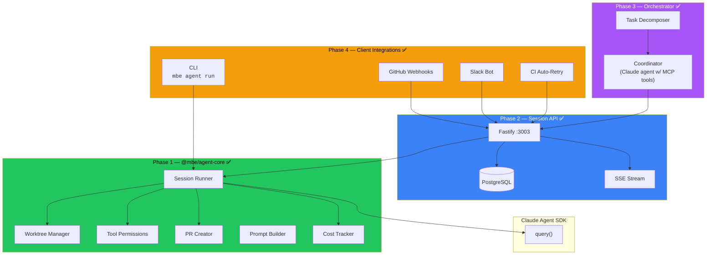
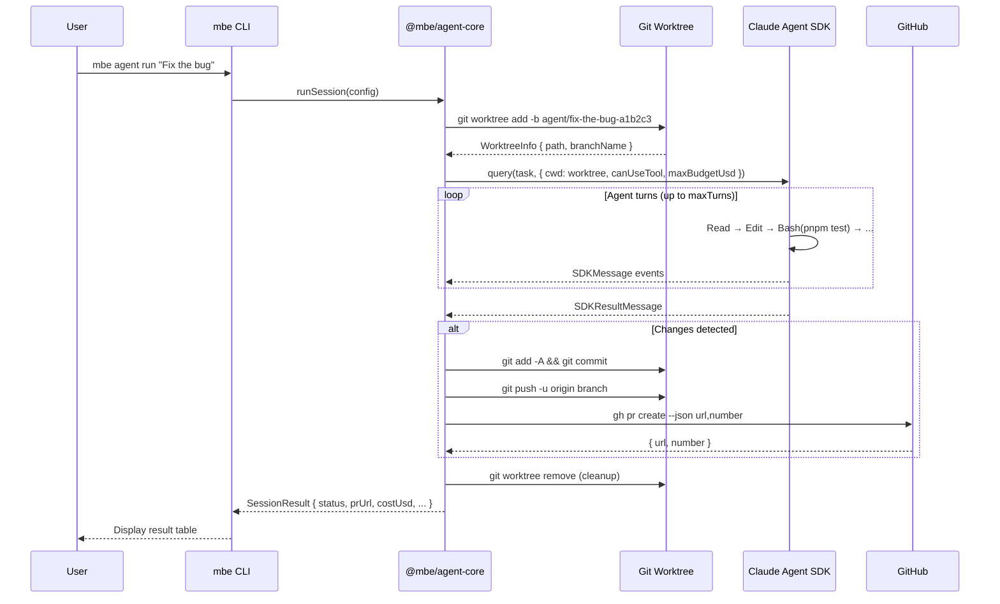
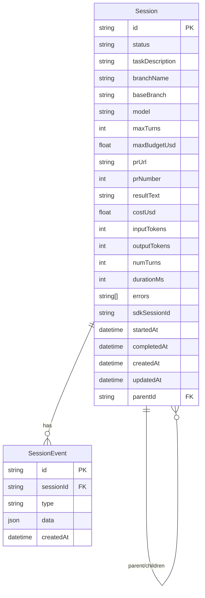
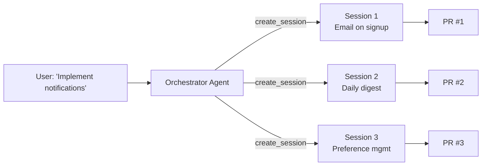
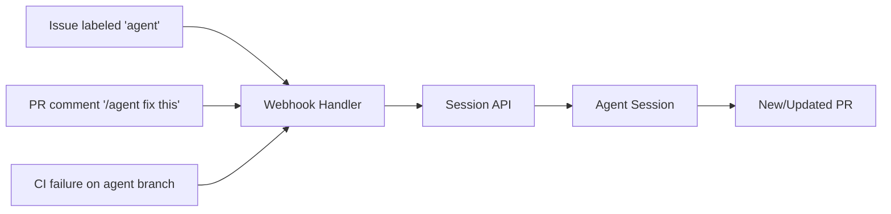

# Agentic Workflows

**Date:** 2026-02-27
**Status:** All 4 Phases Complete

---

## Overview

An autonomous coding agent system that accepts tasks from multiple sources (CLI, API, Slack, GitHub), breaks them into sub-tasks, executes them in isolated git worktrees via the Claude Agent SDK, validates results through CI/CD, and delivers pull requests.

### Design Principles

- **Isolation**: Every session runs in its own git worktree — agents never touch each other or the user's working tree
- **Budget caps**: Hard cost limits per session (`maxBudgetUsd`) prevent runaway spend
- **Security boundary**: `canUseTool` callback blocks destructive operations, path traversal, and external network access
- **Incremental delivery**: Each phase delivers standalone value; Phase 1 is useful on its own

---

## Architecture



---

## Phase 1: CLI Prototype — ✅ Complete

**Outcome:** `mbe agent run "Fix the login bug"` → spawns agent in worktree → creates PR

### Package: `packages/agent-core/`

```
packages/agent-core/
├── src/
│   ├── index.ts               # Public API exports
│   ├── types.ts               # SessionConfig, SessionResult, SessionEvent
│   ├── session-runner.ts      # Core: worktree → SDK query() → commit → push → PR
│   ├── worktree-manager.ts    # Git worktree create/remove/commit/push
│   ├── pr-creator.ts          # GitHub PR via gh CLI (zod-validated)
│   ├── prompt-builder.ts      # System prompt with quality checklist
│   ├── tool-permissions.ts    # canUseTool security boundary
│   ├── cost-tracker.ts        # Extract cost/usage from SDK result
│   └── __tests__/             # 68 unit tests across 6 files
├── package.json
├── tsconfig.json
└── vitest.config.ts
```

### CLI Command: `tools/cli/src/commands/agent.ts`

```
mbe agent run <task>              # Run agent → get PR
  --model <model>                 # default: claude-sonnet-4-6
  --max-budget <usd>              # default: 1.00
  --max-turns <n>                 # default: 50
  --base-branch <branch>          # default: main
  --no-pr                         # skip PR, keep worktree
  -v, --verbose                   # stream agent events
```

### Session Lifecycle



### Security Model

| Layer | Mechanism | Details |
|-------|-----------|---------|
| Tool blocking | `BLOCKED_TOOLS` set | WebSearch, WebFetch, AskUserQuestion, EnterPlanMode, EnterWorktree |
| Bash filtering | `BLOCKED_BASH_PATTERNS` | `rm -rf`, `sudo`, `curl\|bash`, `git push`, `npm publish` |
| Filesystem sandbox | `resolve()` + prefix check | Writes restricted to worktree; path traversal (`../`) resolved before comparison |
| Cost cap | `maxBudgetUsd` | SDK enforces hard budget limit per session |
| Turn limit | `maxTurns` | Prevents infinite loops (default 50) |
| Permission mode | `acceptEdits` | File edits auto-approve; `canUseTool` still enforces security boundary |

### Key Types

```typescript
interface SessionConfig {
  taskDescription: string;      // What the agent should do
  repoPath: string;             // Absolute path to repo root
  baseBranch: string;           // Branch to create worktree from
  model: string;                // Claude model ID
  maxTurns: number;             // Hard turn limit
  maxBudgetUsd: number;         // Hard cost cap in USD
  allowedTools: string[];       // SDK tools the agent can use
  createPr: boolean;            // Whether to push + create PR
}

interface SessionResult {
  sessionId: string;
  status: "pending" | "running" | "succeeded" | "failed" | "cancelled";
  branchName: string;
  prUrl: string | null;
  costUsd: number;
  tokenUsage: { inputTokens: number; outputTokens: number };
  durationMs: number;
  numTurns: number;
  resultText: string;
  errors: string[];
}
```

### Verification

```
Lint:      ✅ @mbe/agent-core, @mbe/cli, @mbe/types
Typecheck: ✅ @mbe/agent-core, @mbe/cli, @mbe/types
Tests:     ✅ 68/68 pass across 6 test files (191ms)
CLI:       ✅ mbe agent run --help displays correct usage
```

---

## Phase 2: Session API Service — ✅ Complete

**Outcome:** REST API at `localhost:3003` for managing agent sessions over HTTP, with persistence and SSE streaming.

### Service: `services/agent/`

Follows existing `services/users/` patterns (Fastify + Prisma + Scalar docs).

```
services/agent/
├── prisma/
│   └── schema.prisma           # Session + SessionEvent models
├── src/
│   ├── index.ts                # Server startup (port 3003)
│   ├── app.ts                  # buildApp() — Fastify setup
│   ├── routes/
│   │   ├── health.ts           # Health check endpoint
│   │   ├── sessions.ts         # CRUD + cancel
│   │   ├── session-events.ts   # SSE endpoint
│   │   ├── orchestrate.ts      # Task orchestration (Phase 3)
│   │   ├── webhooks.ts         # GitHub webhooks (Phase 4)
│   │   ├── sessions.test.ts    # 10 tests
│   │   ├── orchestrate.test.ts # 5 tests
│   │   └── webhooks.test.ts    # 14 tests
│   ├── services/
│   │   ├── database.ts         # Prisma client singleton
│   │   ├── session.ts          # DB operations
│   │   └── session-executor.ts # Bridges API ↔ @mbe/agent-core
│   └── schemas/
│       └── index.ts            # OpenAPI schemas
├── package.json
├── tsconfig.json
└── vitest.config.ts
```

### Prisma Models



### API Routes

| Method | Path | Description |
|--------|------|-------------|
| `POST` | `/v1/sessions` | Create + start session |
| `GET` | `/v1/sessions` | List (paginated, filterable by status) |
| `GET` | `/v1/sessions/:id` | Get details |
| `POST` | `/v1/sessions/:id/cancel` | Cancel running session |
| `DELETE` | `/v1/sessions/:id` | Delete + cleanup worktree |
| `GET` | `/v1/sessions/:id/events` | SSE stream |
| `POST` | `/v1/sessions/:id/prompt` | Multi-turn follow-up |

### CLI Extensions

```
mbe agent start <task>     →  POST /v1/sessions
mbe agent list             →  GET /v1/sessions
mbe agent status <id>      →  GET /v1/sessions/:id
mbe agent logs <id>        →  GET /v1/sessions/:id/events (SSE)
mbe agent cancel <id>      →  POST /v1/sessions/:id/cancel
```

---

### Verification

```
Lint:      ✅ @mbe/agent-service
Typecheck: ✅ @mbe/agent-service
Tests:     ✅ 29/29 pass across 3 test files
CLI:       ✅ agent start/list/status/logs/cancel/delete commands
```

---

## Phase 3: Orchestrator — ✅ Complete

**Outcome:** `mbe agent orchestrate "big task"` → decomposes into sub-tasks → spawns parallel sessions → coordinates results.

### New Files in `packages/agent-core/`

- `src/task-decomposer.ts` — Orchestrator config types + system prompt builder
- `src/orchestrator.ts` — Meta-agent with MCP tools for session management
- `src/__tests__/task-decomposer.test.ts` — 9 tests
- `src/__tests__/orchestrator.test.ts` — 7 tests

The orchestrator is itself a Claude agent that uses the Session API as custom MCP tools:



### MCP Tools for Orchestrator

| Tool | Maps To | Purpose |
|------|---------|---------|
| `create_session` | `POST /v1/sessions` | Spawn a sub-task session |
| `check_session` | `GET /v1/sessions/:id` | Poll for completion |
| `cancel_session` | `POST /v1/sessions/:id/cancel` | Abort a stuck session |
| `list_sessions` | `GET /v1/sessions` | Check overall progress |

### CLI Command

```
mbe agent orchestrate <task>
  --model <model>                # Orchestrator model (default: claude-sonnet-4-6)
  --session-model <model>        # Child session model
  --max-budget <usd>             # Per-session budget (default: 1.00)
  --max-concurrent <n>           # Parallel sessions (default: 3)
```

### API Endpoint

```
POST /v1/orchestrate
  { taskDescription, model?, sessionModel?, maxBudgetPerSession?, maxConcurrentSessions? }
  → { parentSessionId, status, childSessionIds, summary, totalCostUsd, durationMs }
```

### Verification

```
Lint:      ✅ @mbe/agent-core
Typecheck: ✅ @mbe/agent-core, @mbe/agent-service, @mbe/cli
Tests:     ✅ 84/84 pass in agent-core (8 files), 29/29 in agent-service (3 files)
```

---

## Phase 4: Client Integrations — ✅ Complete

### GitHub Integration



- Issue labeled `agent` → auto-create session
- PR comment `/agent fix this` → spawn session
- CI failure on agent branch → auto-retry (up to 3x)

### GitHub Action

```yaml
# .github/workflows/agent-task.yml
on:
  workflow_dispatch:
    inputs:
      task:
        description: "Task for the agent"
        required: true
```

### Webhook Security

- HMAC-SHA256 signature verification via `GITHUB_WEBHOOK_SECRET`
- Timing-safe comparison to prevent timing attacks
- All inputs validated before session creation

### Slack (future)

- Bot in `#agent-tasks` channel
- Creates sessions, posts status updates to threads

### Verification

```
Lint:      ✅ @mbe/agent-service
Typecheck: ✅ @mbe/agent-service
Tests:     ✅ 29/29 pass (14 webhook tests + 5 orchestrate + 10 sessions)
GH Action: ✅ .github/workflows/agent-task.yml (workflow_dispatch)
```

---

## Final Test Summary

| Package | Lint | Typecheck | Tests |
|---------|------|-----------|-------|
| `@mbe/agent-core` | ✅ | ✅ | 84 passed (8 files) |
| `@mbe/agent-service` | ✅ | ✅ | 29 passed (3 files) |
| `@mbe/cli` | ✅ | ✅ | — |
| `@mbe/types` | ✅ | ✅ | — |

**Total: 113 tests, 0 failures.**

---

## Dependencies

| Dependency | Version | Purpose |
|------------|---------|---------|
| `@anthropic-ai/claude-agent-sdk` | `^0.1.0` | Claude Code programmatic API |
| `zod` | `^3.23.0` | Schema validation (gh output, API inputs) |
| `commander` | `^12.0.0` | CLI framework (existing) |
| `fastify` | `^5.0.0` | API framework (Phase 2) |
| `@prisma/client` | `^6.0.0` | Database ORM (Phase 2) |

---

## Cost Controls

| Control | Default | Scope |
|---------|---------|-------|
| `maxBudgetUsd` | $1.00 | Per session |
| `maxTurns` | 50 | Per session |
| Rate limit | 5 concurrent | Per API instance (Phase 2) |
| Model selection | `claude-sonnet-4-6` | Balances capability vs. cost |
