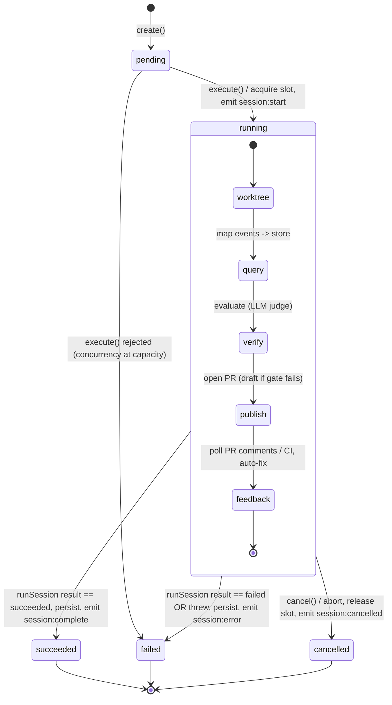

# SessionLifecycleOrchestrator — design note

> **Status:** design under HITL review (issue #2001). This document is the
> artifact a human validates **before** the refactor is accepted. It records
> the orchestrator's public interface (storage seam, cancellation semantics,
> event-emission contract) and the lifecycle state machine.

## Problem

The agent session lifecycle — create → queue → execute → map events → evaluate
→ PR → feedback poll → persist — has no single owner. It is smeared across:

| Module                                            | Lifecycle responsibility today                                      |
| ------------------------------------------------- | ------------------------------------------------------------------- |
| `services/agent/routes/sessions.ts`               | HTTP create/cancel/delete; calls `triggerSession`/`cancelSession`   |
| `services/agent/services/session.ts`              | `triggerSession` (create row + fire-and-forget execute)             |
| `services/agent/services/session-executor.ts`     | status transitions, concurrency, event persistence, `runSession`    |
| `services/agent/services/storage-event-mapper.ts` | `SessionEvent` → stored-event projection                            |
| `packages/agent-core/session-runner.ts`           | the in-process pipeline (worktree → query → verify → PR → feedback) |
| `services/agent/routes/orchestrate.ts`            | parent-session create + status/event writes for orchestration       |

`session-runner.ts` (the phase pipeline from #1992) already owns the **execution**
phases with typed per-phase input/output contracts and injected `PhaseDeps`. What
is missing is a single owner for the **state machine around** that pipeline:
who flips `pending → running → succeeded/failed/cancelled`, who persists events,
who enforces the concurrency slot, and where storage is injected so the same
code path serves both the API service (Prisma) and tests (in-memory).

## Goal

One module — `SessionLifecycleOrchestrator` in `@mbe/agent-core` — owns all
session **state transitions**, with **storage injected at a seam**. Routes
become thin HTTP adapters. The CLI (`mbe agent run`) and the API service drive
the **same** orchestrator code path; only the injected store differs
(Prisma-backed in the service, in-memory in the CLI and in tests).

This builds **on top of** `runSession` (the #1992 phase pipeline) — it does not
replace it. `runSession` stays the unit of execution; the orchestrator is the
state+storage owner that wraps it.

## Public interface

All types live in `packages/agent-core/src/session-lifecycle/`. Status values
reuse the existing `SessionStatus` union (`"pending" | "running" | "succeeded" |
"failed" | "cancelled"`) — no new status vocabulary is introduced.

### Storage seam

The single injection point. The Prisma adapter lives in the service; the
in-memory adapter ships in `@mbe/agent-core` for the CLI and tests.

```typescript
export interface SessionLifecycleStore {
  /** Persist a new session in `pending` status and return it. */
  create(input: CreateSessionInput): Promise<StoredSession>;
  getById(id: string): Promise<StoredSession | null>;
  /** Transition status and merge any terminal result fields. Returns null if absent. */
  updateStatus(
    id: string,
    status: SessionStatus,
    patch?: SessionResultPatch
  ): Promise<StoredSession | null>;
  /** Append a lifecycle/runtime event. Best-effort; never throws into the caller. */
  addEvent(id: string, type: string, data: Record<string, unknown>): Promise<void>;
}

export interface StoredSession {
  readonly id: string;
  readonly status: SessionStatus;
  readonly taskDescription: string;
  readonly baseBranch: string;
  readonly model: string;
  readonly maxTurns: number;
  readonly maxBudgetUsd: number;
  readonly createPr: boolean;
  readonly userId?: string | null;
  readonly parentId?: string | null;
  readonly branchName?: string | null;
  readonly prUrl?: string | null;
  readonly prNumber?: number | null;
  readonly resultText?: string | null;
  readonly costUsd?: number;
  readonly inputTokens?: number;
  readonly outputTokens?: number;
  readonly numTurns?: number;
  readonly durationMs?: number;
  readonly errors: readonly string[];
  readonly sdkSessionId?: string | null;
}
```

### Cancellation semantics

```typescript
cancel(sessionId: string): Promise<boolean>;
```

- `cancel` aborts the in-flight `AbortController` registered by `execute`,
  releases the concurrency slot, transitions the session to `cancelled`, and
  appends a `session:cancelled` event. Returns `true` if a live execution was
  found, `false` otherwise.
- **Honest limitation (preserved from today):** `runSession` does not yet accept
  an `AbortSignal`, so cancellation marks the terminal state and frees the slot
  but does **not** force-kill the underlying SDK query — the in-process pipeline
  runs to its natural end. Wiring the signal into `runSession` is future work,
  out of scope for this consolidation (it must not change execution behaviour).

### Event-emission contract

- During `execute`, the orchestrator subscribes to `runSession`'s
  `SessionEventCallback`. Each `SessionEvent` is passed through an injected
  **`EventProjector`** and, when it yields a stored shape, written via
  `store.addEvent`. The default projector is a passthrough; the service injects
  one that parses `run-hardened-query`'s JSON `MappedEvent`s and applies
  `mapForStorage` (truncation + field selection) — exactly today's behaviour.
- The orchestrator itself emits these **lifecycle** events (independent of the
  pipeline's own events): `session:start` on execute, `session:complete` on a
  terminal result, `session:error` on a thrown failure, `session:cancelled` on
  cancel.
- Event writes are best-effort: a failed `addEvent` never fails the session.

```typescript
export interface StoredEvent {
  readonly type: string;
  readonly data: Record<string, unknown>;
}
export type EventProjector = (event: SessionEvent) => StoredEvent | null;
```

### Concurrency seam (optional)

```typescript
export interface ConcurrencyGate {
  readonly limit: number;
  acquire(sessionId: string): boolean; // atomic check-and-reserve
  release(sessionId: string): void;
  activeCount(): number;
}
```

Structurally satisfied by the service's existing `SessionConcurrency`. When
omitted (CLI / tests), `execute` runs without a slot gate. When provided,
`execute` performs the atomic `acquire` and marks the session `failed` if the
gate is at capacity — preserving today's executor behaviour.

### Orchestrator factory

```typescript
export interface SessionLifecycleDeps {
  readonly store: SessionLifecycleStore;
  readonly resolveRepoPath: () => string;
  readonly runSession?: RunSessionFn; // default: the real runSession
  readonly concurrency?: ConcurrencyGate; // default: none (CLI / tests)
  readonly projectEvent?: EventProjector; // default: passthrough
  readonly allowedTools?: readonly string[]; // default: DEFAULT_SESSION_CONFIG.allowedTools
  readonly feedbackLoop?: FeedbackLoopConfig;
}

export interface SessionLifecycleOrchestrator {
  create(input: CreateSessionInput): Promise<StoredSession>;
  /** Run a created session to a terminal state. Returns the SessionResult, or null
   *  if the session is absent or was rejected by the concurrency gate. */
  execute(sessionId: string): Promise<SessionResult | null>;
  cancel(sessionId: string): Promise<boolean>;
  getActiveSessionCount(): number;
}

export function createSessionLifecycleOrchestrator(
  deps: SessionLifecycleDeps
): SessionLifecycleOrchestrator;
```

`runSession` is injected (defaulting to the real implementation) so tests drive
the full state machine against a fake pipeline + in-memory store, with no SDK,
git, or network calls.

## State machine



Notes:

- The inner `running` composite is `runSession`'s phase pipeline (#1992); the
  orchestrator does not re-implement it. A failed phase still short-circuits
  inside `runSession` and surfaces as a `failed` (or partial-PR) result.
- `succeeded` requires `result.status === "succeeded"`; every other terminal
  result (including stuck/budget-enforced) maps to `failed`.
- Concurrency slot is acquired on the `pending → running` edge and released in a
  `finally`, so it is freed on every terminal edge (including cancel).

## Adoption plan

1. **agent-core** — ship `session-lifecycle/` (types, `InMemorySessionStore`,
   `createSessionLifecycleOrchestrator`) + lifecycle test suite against the
   in-memory store. Export from the package index.
2. **services/agent** — add a Prisma-backed `SessionLifecycleStore` adapter that
   delegates to `sessionService` (mapping the lowercase `SessionStatus` to the
   Prisma uppercase enum). `session-executor.ts` becomes a thin construction of
   the orchestrator with that store + `defaultConcurrency` + the
   `mapForStorage` projector, preserving its exported `executeSession` /
   `cancelSession` / `getActiveSessionCount` surface so routes and the liveness
   monitor are untouched.
3. **CLI** — `mbe agent run` (claude adapter) drives the orchestrator with the
   in-memory store, so CLI and API share the exact code path; the returned
   `SessionResult` keeps the CLI's rich console output intact.

## Reviewer questions

Please validate **before** approving the implementation:

1. Is the **storage seam** (`SessionLifecycleStore`) the right cut — four
   methods, lowercase status, store owns persistence detail?
2. Are the **cancellation semantics** acceptable, including the honest
   limitation that the in-flight `runSession` is not force-killed until it
   accepts an `AbortSignal`?
3. Is the **event-emission contract** (injected `EventProjector` + four
   orchestrator-owned lifecycle events) the right division between generic
   lifecycle events and service-specific projection?
